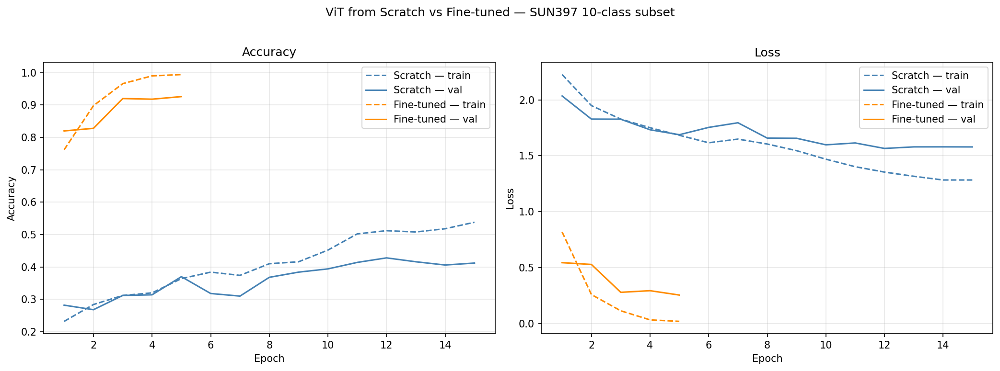
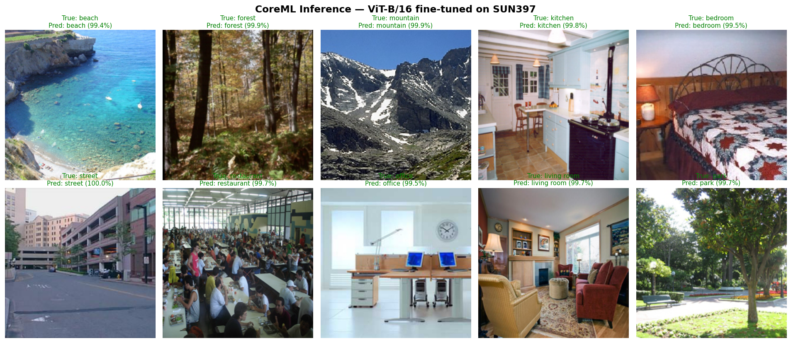
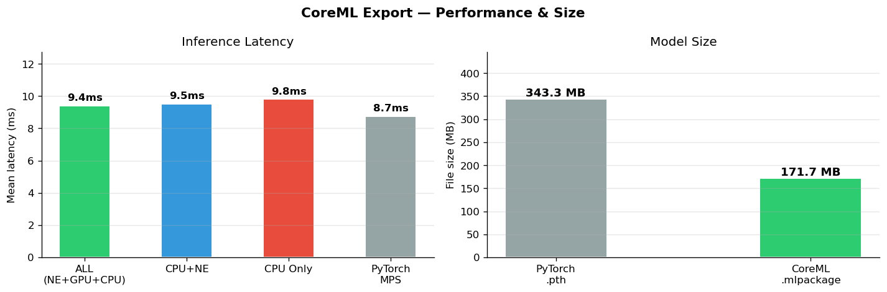

# Smart Scene Classifier

Real-time scene classification on iPhone using Vision Transformer — with attention map visualization showing which regions of the image drove the prediction.

[Read the blog post →](https://www.preeti-chauhan.com/Smart-Scene-Classifier/)

---

## Dataset

[SUN397](https://3dvision.princeton.edu/projects/2010/SUN/) — scene understanding dataset with 397 indoor and outdoor categories.

A 10-class camera-relevant subset is used: beach, forest, mountain, kitchen, bedroom, street, restaurant, office, living room, park. Loaded via HuggingFace datasets (`pc-ml-dl/sun397`).

---

## Model

**Vision Transformer (ViT-B/16)** — Dosovitskiy et al., 2020

- Splits the image into 16×16 patches, linearly embeds each patch, and processes them as a sequence with a standard transformer encoder
- A learnable CLS token aggregates information from all patches and is passed to a classification head
- Pretrained on ImageNet-21k, fine-tuned on the 10-class SUN397 subset using [timm](https://huggingface.co/docs/timm)

| | ViT from Scratch | ViT Fine-tuned |
|---|---|---|
| Architecture | 6-layer ViT, d=256 (~6M params) | ViT-B/16 (~86M params) |
| Starting weights | Random | ImageNet-21k pretrained |
| Val accuracy | ~43% (15 epochs) | ~93% (5 epochs) |
| Converges | Slowly | Within 3 epochs |

Note: the scratch model uses a reduced config (6 layers, d_model=256) because training full ViT-B/16 from random weights on 500 images (50 per class) causes extreme overfitting — the model memorizes before it generalizes. The smaller architecture gives scratch training a fair chance. Fine-tuned ViT-B/16 reaches ~93% validation accuracy in 5 epochs.

---

## Notebooks

> **Note:** If running in Colab, local filesystem resets when the session ends. Run cells in order — Drive is handled automatically where needed.

| Notebook | Description |
|---|---|
| `01_self_attention.ipynb`  | Scaled dot-product attention and multi-head attention from scratch |
| `02_vit_from_scratch.ipynb`  | Full ViT: patch embeddings, CLS token, positional encoding, transformer encoder |
| `03_train_and_compare.ipynb`  | Train ViT from scratch vs fine-tune pretrained ViT on SUN397 — saves checkpoints to Google Drive |
| `04_gradcam_visualization.ipynb`  | CLS token attention maps — visualizing which patches drove the prediction |
| `05_coreml_export.ipynb`  | Export to CoreML, benchmark on Apple Neural Engine — loads checkpoint from Google Drive |

---

## Results

### Training — Scratch vs Fine-tuned ViT

Fine-tuning a pretrained ViT-B/16 converges faster and reaches higher accuracy than training from scratch on the same 10-class SUN397 subset.

---

### Attention Maps — Where the Model Looks

ViT classifies via the CLS token, not individual patches. The attention map shows which patches the CLS token attended to in the last transformer block when making its prediction. Hot regions (red/yellow) are where the model focused.

---

### CoreML Inference — 10-class predictions

Each image is classified by the exported CoreML model running on Mac. Labels in green are correct predictions; red are misclassifications. Confidence shown as the softmax probability of the top class.

---

### Latency Benchmark

Single-image inference time across CoreML compute unit configurations vs PyTorch on MPS. Results measured on Apple Silicon (50 runs after 10 warmup).

| Compute Unit | Mean Latency |
|---|---|
| ALL (NE+GPU+CPU) | **9.4 ms** |
| CPU + NE | 9.5 ms |
| CPU Only | 9.8 ms |
| PyTorch MPS | 8.7 ms |

ViT-B/16 (171 MB) is too large to benefit significantly from the Neural Engine — the speedup vs CPU-only is only 1.0×, compared to 4× for smaller models like YOLOv8n. PyTorch MPS outperforms all CoreML variants here, running directly on the GPU via Metal.

---

## iPhone App

Scene classification running on-device via CoreML and Apple Neural Engine.

---

## Stack

| Tool | Role |
|---|---|
| [PyTorch](https://pytorch.org) | Model training (MPS backend — Apple Silicon) |
| [timm](https://huggingface.co/docs/timm) | Pretrained ViT weights for fine-tuning |
| [einops](https://einops.rocks) | Readable tensor operations |
| [coremltools](https://apple.github.io/coremltools) | Export to CoreML for on-device inference |
| [matplotlib](https://matplotlib.org) | Attention map visualization |
